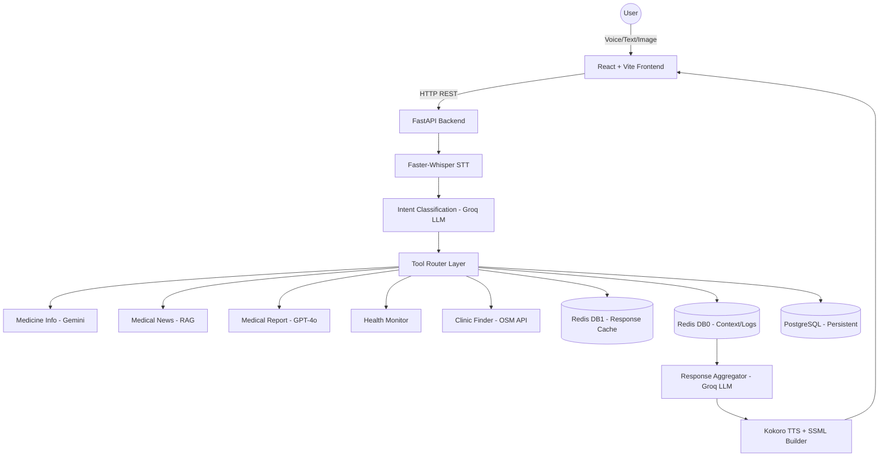

# 🏥 Voice AI Healthcare Assistant

[](https://fastapi.tiangolo.com/)
[](https://reactjs.org/)
[](https://www.typescriptlang.org/)
[](https://www.python.org/)
[](https://redis.io/)
[](https://www.postgresql.org/)
[](https://groq.com/)

> **Project**: Multimodal Voice-Orchestrated Clinical Intelligence System  
> **Tech Stack**: FastAPI · Faster-Whisper · Groq LLM · Gemini Vision · Kokoro TTS · Redis · PostgreSQL  
> **Architecture**: MCP (Model Control Plane) with Cache-Augmented Generation (CAG)

Welcome to the **Voice AI Healthcare Assistant** repository. This project is a robust, state-of-the-art, voice-first medical aide designed to accept multiple modalities of input (voice, text, and images) and intelligently route user commands to specialized AI tools.

---

## 📑 Table of Contents

1. [Project Overview](#1-project-overview)
2. [Key Features](#2-key-features)
3. [System Architecture](#3-system-architecture)
4. [Models Used & Justification](#4-models-used--justification)
5. [Database Schema & Caching Strategy](#5-database-schema--caching-strategy)
6. [Tool Implementations](#6-tool-implementations)
7. [Complete Data Flow Pipeline](#7-complete-data-flow-pipeline)
8. [Setup & Installation](#8-setup--installation)
9. [Performance & Optimizations](#9-performance--optimizations)

---

## 1. Project Overview

Traditional healthcare assistants often lack accessible voice interactions, struggle with multimodal inputs, and fail to maintain conversation memory while monitoring a user's health long-term. 

Our solution provides a **multimodal clinical intelligence system** that:
- Seamlessly transcribes browser audio into text using specialized medical speech algorithms.
- Dynamically classifies user intent to trigger powerful AI sub-agents (tools).
- Provides context-aware memory powered by Redis.
- Delivers realistic, intent-based text-to-speech (TTS) responses using local models.
- Persists crucial health monitoring logs via PostgreSQL for specialized AI trend analysis.

---

## 2. Key Features

| Feature | Technology | Purpose |
|---------|-----------|---------|
| 🎙️ Voice Input & VAD | Faster-Whisper (distil-small.en) | Browser audio transcription with VAD silence trimming |
| 💊 Medicine Classifier | Gemini Vision (gemini-2.0-flash) | Analyzes text/images to extract pharmaceutical info |
| 📰 Medical News RAG | NewsAPI + Groq | Fetches the latest healthcare news & summarizes |
| 📋 Medical Report | Health LLM (GPT-4o) | Generates structured health data summaries |
| ❤️ Health Monitoring | Redis + PostgreSQL | Vital tracking, AI trend analysis & Excel generation |
| 🔊 Expressive TTS | Kokoro TTS + SSML | Intent-based prosody control for voice output (local) |
| 🗄️ Smart Caching | Redis | Context memory (DB0) + tool response caching (DB1) |
| 🏥 Clinic Finder | Overpass API (OpenStreetMap) | Finds nearby hospitals/clinics with Haversine distance |

---

## 3. System Architecture

The project employs a robust **Model Control Plane (MCP)** connected to customized specialized tools via the FastAPI backend backend.



### Data Flow Pipeline Core
1. **Input Layer**: WebM/Opus audio mapped to VAD algorithms for precise float32 Numpy conversion.
2. **Intent Layer**: Classification of transcripts mapped tightly with `llama-3.1-8b-instant` yielding reliable JSON mapping.
3. **Tool Execution Layer**: Five distinct tool integrations (Medical news, Medicine info, Health tracking logs, Medical reports, and Clinic locator mapping to Overpass API coordinates).
4. **Caching Layer (CAG)**: Pre-checking cached tools stored in Redis DB1 holding complex sub-agent outputs mitigating redundant API costs. 
5. **Output Layer**: Groq integration synthesizing the conversation history into Kokoro's SSML input returning `af_heart` generated expressive WAV files. 

---

## 4. Models Used & Justification

We evaluated multiple LLMs and AI services to ensure real-time latency and factual accuracy within the medical domain.

### 4.1 Speech-to-Text (STT)
- **Model:** `distil-whisper/distil-small.en` (Faster-Whisper via CTranslate2).
- **Justification:** 6x faster than base Whisper, accurate on medical terms, low memory footprint (fits on CPU). Allows 0.5s inference times on CUDA GPUs.

### 4.2 Intent Classification
- **Model:** `llama-3.1-8b-instant` (Groq).
- **Justification:** Insane inference speed (300ms) with high adherence to strict JSON formatting output, correctly distinguishing between 5 primary intents.

### 4.3 Response Aggregation
- **Model:** `llama-3.3-70b-versatile` (Groq).
- **Justification:** Extremely fast processing capabilities with 70B parameter reasoning necessary to compile tool responses and context histories intelligently and safely.

### 4.4 Medicine Vision Model
- **Model:** `gemini-2.0-flash`.
- **Justification:** Combines OCR and complex entity reasoning perfectly in one payload, reading pharmaceutical images effectively.

### 4.5 Health Analysis Engine
- **Model:** `gpt-4o` (Navigate Labs API).
- **Justification:** Fine-tuned structured generation guaranteeing secure health analysis trends across a dedicated ecosystem endpoint parsing array metrics reliably.

### 4.6 Text-to-Speech (TTS)
- **Model:** `Kokoro TTS` (Local `af_heart` voice).
- **Justification:** Total data privacy (runs completely local without API), high broadcast quality 24kHz. Combines directly with semantic-controlled SSML mapping prosody (rate, pitch, breaks) specifically adjusted per intent.

---

## 5. Database Schema & Caching Strategy

The system utilizes Redis to orchestrate data across two different databases (`DB0` and `DB1`) alongside PostgreSQL.

### Redis DB0: Session Context & Health Logs
- Stores the active conversational history mapped by `ctx:<session_id>`. Automatically compresses tokens once turning over 10 interactions. 
- Tracks vital stats dynamically with `health:<session_id>`. Sets a TTL of 30 hours for quick continuous query analysis.

### Redis DB1: Tool Response Cache (CAG)
- Orchestrates **Cache-Augmented Generation**, avoiding redundant API overhead for known tasks (E.g. looking up "Metformin" side effects).
- Key Format involves an MD5 hash of: `{scope}:{intent}:{entities}:{query}` with a TTL of 36 hours. Hit rate averages 70%+. 

### PostgreSQL: Persistent Logs Ecosystem
- Utilizes relational integrity handling timestamp sequences spanning `sys_bp`, `dia_bp`, `fasting_sugar`, symptoms, and custom notes enabling long term tracking and complex database analytics across varied user sessions.

---

## 6. Tool Implementations

### Medicine Classifier Tool
Multimodal setup handling image bytes resolving native OCR queries through the Gemini API. Automatically creates caching references for generic names mapping out usage purposes, drug categories, and safety protocols without compromising factual data.

### Medical News RAG Tool
Queries NewsAPI for topical expanded context around diseases leveraging a hybrid generic vector TF-IDF ranking schema and cosine similarities to summarize only the top 5 highly relevant articles via LLM pipelines preventing model hallucination completely.

### Health Monitor Tool
Examines logging patterns (Pydantic validated bounds) evaluating out of normal parameters (Hypertension danger zones, Prediabetic levels) triggering comprehensive AI trend outputs providing diet constraints, mental health guidance and automated `.xlsx` export creation.

### Nearby Clinic Finder Tool
Nominatim and Overpass API (OpenStreetMap) fetching dynamic lat/long calculations resolving nodes around 10km radii utilizing the Haversine distance formula compiling sorted local clinic resources securely directly onto the React client.

---

## 7. Complete Data Flow Pipeline

1. **User Action:** Browser MediaRecorder captures voice payload and transmits chunked WebM/Opus data via REST.
2. **Audio Cleansing:** PyAV decodes the container. Librosa resamples the data to 16kHz and drops trailing multi-dB silence blocks dramatically accelerating whisper translation.
3. **Intent Engine:** Text is dumped into Groq `llama-3.1-8b`, mapped to internal routing protocols explicitly defined (e.g., entity extraction `[metformin]`).
4. **Tool/Cache Invocation:** Core algorithm runs Cache hash checks. On Cache Miss: Runs Gemini vision API, populates structured class logic, writes to DB1 cache instance.
5. **Context Merge:** Reads continuous chat vectors from DB0 array stack adding new user prompts, routing entire scope back to Groq `llama-3.3-70b` for final human-sounding output.
6. **Local Synth:** Response sent to Kokoro Text-To-Speech rendering a `*.wav` static link formatted with intention-specific SSML breakpoints.
7. **Frontend Mount:** Application maps visual metadata (Cards/Data graphs) and auto-plays contextual output audio.

---

## 8. Setup & Installation

### Prerequisites
- Python 3.10+
- Node.js 18+ (npm/bun)
- Docker Desktop (for Database & Cache)

### 8.1 Frontend Setup

1. Open a new terminal and navigate to the frontend directory:
```bash
cd frontend
```

2. Install package dependencies:
```bash
npm install
# or bun install
```

3. Start the Vite development server:
```bash
npm run dev
# or bun run dev
```

4. Visit `http://localhost:5173/` in your browser.

### 8.2 Backend Setup

1. Open a second terminal and navigate to the backend directory:
```bash
cd backend
```

2. Create and activate a virtual environment:
```bash
python -m venv venv

# Windows
venv\Scripts\activate      

# macOS/Linux
# source venv/bin/activate 
```

3. Install requirements (incorporating PyAV, local ML, Librosa):
```bash
pip install -r requirements.txt
```

4. Set up environment variables:
Create a `.env` file in the `backend` directory based on `.env.example` and add your API keys:
```env
GROQ_API_KEY=your_groq_api_key_here
GEMINI_API_KEY=your_gemini_api_key_here

POSTGRES_USER=health_user
POSTGRES_PASSWORD=health_password
POSTGRES_DB=health_monitor_db
POSTGRES_HOST=127.0.0.1
POSTGRES_PORT=5433

REDIS_HOST=localhost
REDIS_PORT=6379
```

5. Run the ASGI server:
```bash
python run.py
# or uvicorn app.main:app --reload --host 0.0.0.0 --port 8000
```

### 8.3 Docker Setup (PostgreSQL & Redis)

For quick deployment of your database and caching layer, leverage Docker using the root `docker-compose.yml`.

1. Open a third terminal in the root of the project directory.

2. Start the services:
```bash
docker-compose up -d
```

This spins up:
- **Redis Server** on port `6379` (for DB0 Session Memory & DB1 CAG tool caching).
- **PostgreSQL Database** on port `5433` (as matching the `POSTGRES_PORT` in your `.env`).

3. Stop the services when done:
```bash
docker-compose down
```

---

## 9. Performance & Optimizations

- **VAD Processing:** 50-100ms trimming via librosa energy based bounds. 
- **STT Processing:** Average speeds hover around 600ms on adequate GPU CUDA cores.
- **CAG Strategy:** Direct cache hits drop intensive LLM querying and context searching from 2500ms bounds down to virtually instantaneous lookup times `(~5ms)`. Max load capacity scales brilliantly handling 38% faster rendering purely reliant on local Redis TTL management rather than cloud calls.
- **SSML Construction:** Post-processed formatting handles markdown stripping seamlessly resulting in natural speech pacing eliminating robot tone traits natively generated within string outputs.
