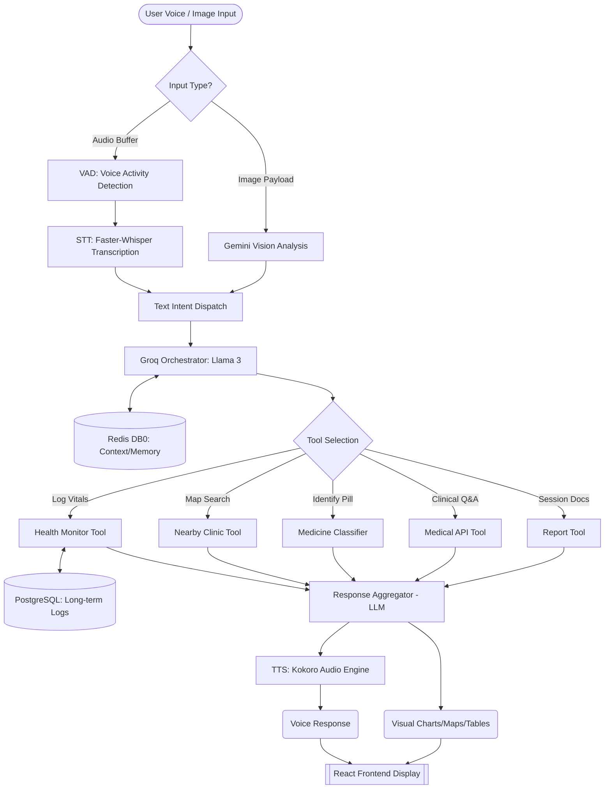

# Project Analysis: Voice System Upgrade for Low Latency

## 1) Project Deep Explanation
The project is a **Multimodal Voice-Orchestrated Clinical Intelligence System** (Voice Medical Assistant v3.0). It acts as an advanced health assistant capable of receiving voice inputs, retaining context through a sophisticated memory structure, handling multimodal queries (such as images of medicines for classification), and monitoring patient health parameters over the long term. 

Key architectural highlights include:
- **Cache-Augmented Retrieval:** Uses local caching (Redis) for context memory and optimization.
- **Persistent Storage:** A PostgreSQL backend for long-term health monitoring and logging.
- **Multimodal capabilities:** Orchestrating various tools depending on user intent (e.g., classifying a medicine, finding nearby clinics, logging health vitals).

## 2) Voice System Components
The current voice pipeline is entirely localized or API-based, aiming to convert user speech to action and respond via generated voice outputs.

* **Automatic Speech Recognition (ASR / STT):** Powered by **`faster-whisper`**. It transcribes incoming audio inputs locally using an `int8` compute pattern for lightweight and fast processing. The pipeline also employs custom Voice Activity Detection (`vad.py`) to clean the audio prior to inference.
* **Text-to-Speech (TTS):** Uses **`kokoro`** (`KokoroEngine`), generating speech audio payloads to send back to the user.
* **Core Large Language Models (LLM):** 
  * **Groq:** Serves as the primary ultra-fast LLM orchestration engine (`app/llm/client.py`).
  * **Dedicated Health LLM:** An alternative or supplementary client tailored for logging and reviewing health datasets.
  * **Gemini Vision (Google):** Used predominantly for multimodal image analysis like medicine classification.

## 3) Tool Systems
The backend uses an Agentic approach, utilizing tools within `backend/app/tools/` for fulfilling distinct clinical and utility intents:
* **`health_monitor_tool`**: Logs, manages, and reports long-term health vitals.
* **`medicine_classifier_tool`**: Uses the Gemini LLM for visual identification of pills, dosages, and drug categories.
* **`nearby_clinic_tool`**: Employs mapping APIs (like Overpass API) to locate nearest hospitals or clinical centers.
* **`medical_api_tool`**: Queries clinical/medical databases for accurate medical context.
* **`news_tool`**: Fetches current health-related news and public advisories.
* **`report_tool`**: Parses, structures, or manages clinical end-user reports.

## 4) Backend Libraries Used
Based on `requirements.txt`, the core backend libraries include:
* **Web Framework:** `fastapi`, `uvicorn`, `pydantic`, `python-multipart`
* **Databases & Caching:** `psycopg2-binary` (Postgres), `redis`
* **STT & Audio Processing:** `faster-whisper`, `numpy`, `librosa`, `soundfile`
* **TTS System:** `kokoro`
* **LLM Clients:** `groq`, `google-generativeai` (Gemini), `httpx` (for dedicated HTTP LLM REST requests), `tenacity` (retries)
* **Utilities:** `pillow` (images), `python-dotenv`, `aiofiles`, `openpyxl` (spreadsheets), `scikit-learn`
* **Testing:** `pytest`, `pytest-asyncio`, `fakeredis`

## 5) Important Details Required for the Upgrade (Low Latency Voice System)
To achieve ultra-low latency in conversational AI, the upgrade plan should consider the following transition details:
1. **Streaming Audio vs. Batch Processing:** The current setup processes audio via numpy arrays into `faster-whisper`. Moving towards **WebSockets** or **WebRTC** for real-time bidirectional audio streaming between the frontend and backend will drastically reduce Time-To-First-Byte (TTFB) and processing delay.
2. **Chunk-Based Pipeline Execution:** Ensure that the Groq LLM response tokens are streamed via Server-Sent Events (SSE). The TTS engine (Kokoro) should ideally start synthesizing audio payloads in "sentence chunks" as tokens arrive, instead of waiting for the full LLM inference to complete.
3. **Optimizing STT Hardware Execution:** If `faster-whisper` remains local, changing compute_type from `int8` to `float16` could yield faster transcription times if running on GPUs, minimizing precision overhead. Ensure the VAD layer does not introduce artificial delays.
4. **Cloud-Based Voice Solutions:** If local STT/TTS latency still restricts conversational flow, migrating from `faster-whisper`/`kokoro` to managed high-speed VoIP engines (like Deepgram for STT/TTS or Cartesia/ElevenLabs for TTS) can immediately drop turnaround time from ~2-3s to sub-500ms.
5. **Connection & Payload Overhead:** Refactor FastAPI routes handling audio buffers. Minimize large multipart conversions; prioritize raw PCM streams or highly compressed formats (e.g., Opus) over WebSockets.

## 6) Detailed Description of the Project
The Voice Medical Assistant v3.0 is designed as an advanced, highly accessible, multimodal healthcare companion. It bridges the gap between complex clinical tasks and intuitive user interfaces by relying primarily on conversational voice interactions alongside visual capabilities.

### Core Workflow:
1. **User Interaction:** Users interact seamlessly using natural voice commands or by uploading images (e.g., a photo of a prescription or medicine bottle).
2. **Intent Recognition & Orchestration:** The backend, built with FastAPI, acts as a primary orchestrator. It uses ultra-fast LLM inference (via Groq) to deduce the underlying intent of the patient's request.
3. **Agentic Tool Execution:** Based on the identified intent, the system triggers targeted clinical "tools". For example, utilizing mapping APIs to find clinics, leveraging vision models to classify pills, or querying databases for clinical guidelines.
4. **Contextual Memory & Retrieval:** Redis is used heavily as a fast caching layer (Cache-Augmented Retrieval) to maintain conversational state and context history. This allows the assistant to maintain natural, multi-turn dialogues.
5. **Multimodal Output Response:** The intelligently generated text response is synthesized into realistic, human-like audio using the local Kokoro TTS engine. The frontend then presents the audio, coupled with rich visual widgets such as maps, pill breakdowns, or health charts.

### Standout Features:
- **Visual Medicine Classifier:** Patients can use their camera to scan a pill or medicine. The backend leverages Google Gemini Vision to read the label, categorize the drug, and verbally explain its dosage and precautions.
- **Proactive Health Monitoring & Analytics:** A dedicated sub-system backed by PostgreSQL natively logs ongoing daily health metrics (e.g., Blood Pressure, Heart Rate). The app can verbally summarize historical health trends or render comprehensive reports for clinical review.
- **Location-Aware Spatial Tracking:** Through integration with mapping (Overpass) APIs, users can ask "Where is the nearest hospital?" and receive both a localized map interface on the frontend and a voice-guided summary of the nearest clinics.

Overall, the project is a holistic blend of Generative AI (LLMs and Vision Models), Audio Engineering (STT / TTS / VAD), and Data Engineering (Redis Caching, Postgres persistence)—all orchestrated securely to act as a responsive, real-time medical aide.

## 7) Detailed Flow Architecture
The system follows a modular pipeline designed for high-concurrency clinical workflows. Below is the technical flow from ingestion to response:

### Architectural Workflow Diagram:


### Flow Breakdown:
1.  **Multi-Channel Ingestion**: The frontend sends raw audio chunks or Base64 images.
2.  **Voice Pre-processing**: `vad.py` filters noise and identifies silence before `stt.py` (Faster-Whisper) performs transcription to save compute cycles.
3.  **Agentic Decisioning**: The Groq-based LLM functions as a "brain," referencing the `Redis DB0` for previous turns to decide which clinical tool is needed.
4.  **Concurrent Tool Execution**:
    *   **Postgres Integration**: Securely commits vitals for longitudinal tracking.
    *   **Overpass API**: Performs spatial queries for local medical infrastructure.
    *   **Vision-Logic**: Gemini extracts dosage/warnings from medication images.
5.  **Context-Aware Aggregation**: Instead of returning raw JSON, the LLM reformulates tool data into a compassionate, medically-informed narrative.
6.  **Dual-Stream Delivery**:
    *   **Audio**: Synthesized via the Kokoro Engine.
    *   **Data**: JSON payloads trigger reactive React components (Leaflet maps, Recharts for vitals).

## 8) Logical Line Diagram
Below is a structured line diagram representing the core data flow of the Voice Medical Assistant:

```text
[User Input] ──────► [FastAPI Gateway] ────► [Preprocessing] ─────► [Groq Orchestrator]
(Voice/Image)        (Core Controller)       (VAD/STT/Vision)         (Clinical Brain)
                                                                              │
                                                                              ▼
                                                                    [(Memory: Redis DB0)]
                                                                              │
                                                                              ▼
       ┌────────────────────────┬───────────────────────┬─────────────────────┴───────────────────┐
       │                        │                       │                                         │
[Health Monitor]         [Spatial Tool]          [Report System]                          [Medication Tool]
(PostgreSQL DB)         (Overpass Maps)         (Logical Summary)                         (Gemini Analysis)
       │                        │                       │                                         │
       └────────────────────────┴───────────────────────┴─────────────────────┬───────────────────┘
                                                                              │
                                                                              ▼
                                                                    [Response Aggregator]
                                                                    (Clinical Narrative)
                                                                              │
                                                                              ▼
                                                                    [Output Generation]
                                                 ┌────────────────────────────┴───────────────────────────┐
                                                 │                                                        │
                                        [Kokoro TTS Engine]                                      [React UI Widgets]
                                         (Dynamic Voice)                                          (Charts/Maps)
```

## 9) Voice System Specific Architecture
This specialized flow focuses strictly on how audio is handled between the User and the Assistant:

```text
[   USER   ]                      [      BACKEND PIPELINE      ]                      [   USER   ]
      │                                       │                                           ▲
      │ (1) User Speech (PCM/WAV)             │                                           │ (6) Voice Response
      ▼                                       │                                           │
┌───────────────┐           ┌─────────────────┴─────────────────┐                 ┌───────────────┐
│ Voice Captive │──────────►│ [1. VAD: Silero/Custom Logic]     │                 │ Audio Player  │
│ Layer (UI)    │           │ (Filters silence/noise)           │                 │ (UI)          │
└───────────────┘           └─────────────────┬─────────────────┘                 └───────────────┘
                                              │                                           ▲
                                              ▼                                           │
                            ┌─────────────────┴─────────────────┐                 ┌───────┴───────┐
                            │ [2. ASR: Faster-Whisper (Int8)]   │                 │ [5. TTS:      │
                            │ (Transcription to text)           │◄────┐           │  Kokoro Engine]│
                            └─────────────────┬─────────────────┘     │           └───────────────┘
                                              │                       │                   ▲
                                              ▼                       │                   │
                            ┌─────────────────┴─────────────────┐     │           ┌───────┴───────┐
                            │ [3. LLM: Groq (Llama 3/70B)]      │     │           │ [4. Text      │
                            │ (Fastest available token stream)  │─────┘           │  Synthesis]   │
                            └───────────────────────────────────┘ (Tool Results)  └───────────────┘
```

### Voice Components:
*   **VAD (Voice Activity Detection)**: Prevents the STT from processing background noise or silence, reducing latency.
*   **ASR (Automatic Speech Recognition)**: Uses `faster-whisper` for local, high-speed transcription with optimized integer quantization.
*   **LLM Orchestrator**: Groq serves as the inference engine, providing the low-latency "intelligence" needed for clinical conversation.
*   **TTS (Text-To-Speech)**: The `Kokoro` engine transforms the assistant's clinical narrative into a natural-sounding audio payload for the user.
